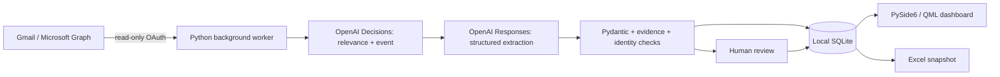

# Job Tracker AI

[](https://github.com/khalifehbasiri/Job-Tracker-AI/actions/workflows/checks.yml)
[](https://github.com/khalifehbasiri/Job-Tracker-AI/actions/workflows/windows-release.yml)

A Windows-first, open-source desktop app that tracks job applications from your email. Your records live in a local SQLite database. Optional AI processing uses **your own OpenAI API key**.

[Credential setup](docs/mailbox-setup.md) · [Engineering portfolio](#engineering-portfolio-for-recruiters-and-teams) · [Architecture](docs/architecture.md) · [Release checklist](docs/release-checklist.md)


## What works in this developer release

- Separate named job searches, with editable names/dates, archiving, and application moves between searches. Every search has its own Excel export.
- Dashboard, company/role search, stage filtering, editable applications, notes, event timelines, and upcoming tasks.
- Excel column-mapping preview and duplicate detection. Export Applications, Events, Tasks, and Search sheets with dropdowns for Stage, Outcome, and task Completed fields. Import/export costs no API credits.
- First-run setup wizard, offline step-by-step guide, and read-only Gmail/Outlook browser sign-in using your own OAuth registration. Select Gmail, Outlook, or all mailboxes for new scans and automatic processing.
- GPT-6 Luna Decisions classifies application confirmations, rejections, assessments, interviews, offers, and other updates; GPT-5.4 mini extracts structured facts and dates with evidence. Clear unmatched updates can create records automatically. Uncertain matches go to a collapsed, expandable review inbox with full-text search.
- Historical email scans for 1, 3, 6, or 12 months, plus custom dates. Process oldest first across connected mailboxes. Preview volume and illustrative API costs, set a USD spending limit, then start. Pause and resume without repeating completed AI work. Invalid AI extractions go to review without automatic paid retries.
- Masked API-key settings, secure OS credential storage, and session-only credentials. No shared developer key.
- Opt-in polling every five minutes with per-sync and daily AI spending limits. Closing to the tray keeps the worker running while your computer is awake.
- Database backups and automatic schema migrations. Manual status corrections are protected from automatic updates.
- Saved light/dark mode, contextual hover indicators, and an in-app credential setup summary with links to the complete offline and online guides.
- Remove import-history entries without deleting applications, saved emails, reviews, or usage records. Completed imports have no Resume button.

**Development preview: email onboarding is still in development.** Users must create their own Google Desktop OAuth registration or Microsoft application client ID, and supply their own OpenAI API key. No project-owned OAuth configuration or user credentials are bundled. Follow the detailed [setup guide](docs/mailbox-setup.md), also available offline inside the app. Automated tests use fake mailboxes and API responses; broad real-account validation remains pending. Project-owned public sign-in is a future milestone; see [public OAuth preparation](docs/public-oauth.md).

## More demo screens

All screenshots use fictional applications and email text, with no real mailbox credentials or paid API calls.

<details>
<summary>Dark dashboard, applications, review inbox, imports, and settings</summary>

**Dark dashboard**


**Applications**


**Collapsed review inbox**


**Import history**


**Dark settings**


</details>

## Engineering portfolio for recruiters and teams

This project demonstrates a desktop product from user workflows to data modeling, provider integration, AI processing, failure recovery, testing, and Windows packaging. The AI produces proposed facts and events; deterministic Python validates them and decides how to update the tracker.

| Engineering area | Concrete implementation |
| --- | --- |
| AI integration | A two-stage pipeline uses GPT-6 Luna **Decisions** for relevance/event classification and GPT-5.4 mini **Responses** with a strict JSON schema for extraction. Pydantic validates fields and dates; evidence must be an exact excerpt from the supplied body. |
| Decision handling | Relevance below 0.1 skips extraction. Automatic updates require relevance and event confidence of at least 0.9 plus a clear identity. Otherwise a review item explains why a human decision is needed. Thresholds are defaults, not measured accuracy guarantees. |
| Application matching | Thread history and requisition IDs precede company/role matching. Weaker matches stay within the selected search. Conflicting IDs and multiple matches cannot silently merge records. |
| Persistence | SQLAlchemy models separate searches, accounts, messages, jobs, applications, events, tasks, scans, reviews, and usage. SQLite foreign keys/unique constraints protect relationships; Alembic upgrades preserve existing data. |
| Reliability | Durable jobs survive pauses/restarts. Cached classifications and extractions avoid repeating completed AI work. Normalized timestamps prevent older emails from overwriting newer status; manual status corrections are protected. |
| Desktop design | Qt Quick/QML handles presentation; a Python bridge exposes services. Serialized background work keeps network calls off the UI thread and outside database transactions. |
| Credentials | Read-only OAuth, browser sign-in, Gmail PKCE, OS keyring storage, and memory-only sessions. Large OAuth caches are split into bounded entries to fit Windows credential-size limits, with rollback on failed writes. |
| Cost control | Reserve estimated usage before dispatch, settle reported tokens, and retain a durable usage ledger. History scans have explicit budgets; opt-in live processing has per-sync and daily limits. |
| Excel interoperability | Styled, filterable snapshots and validated dropdowns. External strings are written as text so email/company content cannot become spreadsheet formulas. |
| Delivery | Locked dependencies, Windows/Linux source checks, PyInstaller folder bundles, Inno Setup, frozen rendering/integrity checks, isolated installer lifecycle tests, release assets, and SHA-256 checksums through GitHub Actions. |

### Design lessons demonstrated

- AI output needs typed validation, evidence, identity checks, and a human fallback. A confident label alone is insufficient to merge applications safely.
- Event history and current state serve different purposes: preserve evidence while projecting the latest valid status and protecting manual corrections.
- Local-first storage supports offline use, but credentials, backups, migrations, and uninstall behavior still require deliberate handling.
- Recovery and cost control belong together: caching completed work and retaining request reservations matter as much as successful classification.
- A working source app is only part of delivery. Frozen Qt dependencies, Windows DLL discovery, installer lifecycle, provider policies, and real-account validation need separate checks.

Read [the architecture](docs/architecture.md), or start with [`ai.py`](src/job_tracker/ai.py), [`worker.py`](src/job_tracker/worker.py), [`services.py`](src/job_tracker/services.py), and [`ui/bridge.py`](src/job_tracker/ui/bridge.py). The commit history groups coherent features and fixes incrementally.

## Technology and processing flow

| Layer | Stack |
| --- | --- |
| Desktop | Python 3.13, PySide6, Qt Quick/QML, Qt Basic controls |
| Database | SQLite with WAL/foreign keys, SQLAlchemy 2, Alembic |
| Validation / HTTP | Pydantic 2, httpx, OpenAI Python SDK |
| Sign-in | google-auth-oauthlib, MSAL public client, OS keyring |
| Excel | openpyxl |
| Development / delivery | uv lockfile, Ruff, pytest/pytest-qt, PyInstaller, Inno Setup, GitHub Actions |



## Run on Windows

Windows preview packaging produces `Job-Tracker-AI-Setup.exe`, `Job-Tracker-AI-Windows-x64.zip`, and `SHA256SUMS.txt`. **No public binary release has been published yet.** Published downloads will appear on [GitHub Releases](https://github.com/khalifehbasiri/Job-Tracker-AI/releases). Successful Windows workflow runs provide build artifacts, which may require GitHub sign-in to download. Builds are unsigned and require your own credentials; review the [release checklist](docs/release-checklist.md).

The installer provides Start menu and optional desktop shortcuts. For the ZIP, extract the entire folder and run `Job-Tracker-AI.exe`; keep `_internal` alongside it. Neither download requires a separate Python installation. Installer upgrades and uninstallation preserve the user database; uninstalling does not erase records or OS credentials.

Maintainers can build both downloads with `uv sync --locked --group build`, install Inno Setup 6, and run `uv run python scripts/build_windows.py --installer`. The [Windows preview workflow](https://github.com/khalifehbasiri/Job-Tracker-AI/actions/workflows/windows-release.yml) validates the frozen app and uploads build artifacts. A version tag creates a draft prerelease for review.

Install [uv](https://docs.astral.sh/uv/getting-started/installation/) and Git, then open PowerShell:

```powershell
git clone https://github.com/khalifehbasiri/Job-Tracker-AI.git
cd Job-Tracker-AI
uv sync --locked
uv run job-tracker
```

uv installs the required Python 3.13 runtime. If you installed uv through pip and it is not on PATH, use `python -m uv` in place of `uv`.

Preview the dashboard with fictional records in a separate database:

```powershell
uv run job-tracker --demo
uv run job-tracker --demo --theme dark
```

For your own records, create a search and add applications or import your existing `.xlsx` workbook from Applications. Manual tracking works without an API key or email connection.

To enable email processing, follow the welcome wizard or configure your own OAuth registration in Settings, connect a mailbox, save your OpenAI key, and preview a scan in Email history. Automatic processing is disabled until you explicitly enable it. The first mailbox connection starts from the present; use a historical scan to reconstruct older applications.

## First use and tracking rules

1. Name a search in the welcome wizard. To rename it or change dates/archive state later, open Settings → Current job search → Edit search. Search dates are labels, not restrictions on scans.
2. Create an OpenAI project key and configure API billing, then Save key → Check key in Settings. Check key reads extraction-model metadata without inference; it does not prove Decisions availability or working inference billing.
3. For Gmail, enable Gmail API in Google Cloud, configure External consent in Testing, add your address as a test user and add `gmail.readonly`. Create a Desktop app OAuth client, download its JSON outside Git, and import it through Configure your OAuth app before Connect Gmail.
4. For Outlook, register an Entra app supporting organizational and personal accounts. Configure Mobile and desktop → `http://localhost`, plus delegated Graph `Mail.Read` and `User.Read`. Save the Application (client) ID through Configure your OAuth app before Connect Outlook. No client secret is needed.
5. Select Gmail, Outlook, or all mailboxes, then preview a date range in Email history and set a USD limit. Connecting alone does not start processing. The [complete setup guide](docs/mailbox-setup.md) includes every registration step and troubleshooting detail; click the information indicator beside setup for a summary.
6. Expand uncertain emails in Review inbox to link, create, or ignore a record. Search includes the full email body. Older pending reviews remain available for explicit resolution without another AI call.
7. Export from Applications or Settings. Opt into automatic processing only when ready. Quit from the tray to stop processing and discard session-only credentials.

**Date applied:** only an application-confirmation email can fill a blank date. Use an explicitly extracted application date when present, otherwise the email's received date in UTC. This fallback is the confirmation date and can differ from the form-submission date. Existing dates are preserved; rejection/interview emails never invent an applied date. On upgrade, blank dates with existing saved confirmation events are repaired locally without API calls.

**Unmatched updates:** a clear, confident rejection/assessment/interview/offer with company and role creates a record at that status. An unmatched rejection is `Applied / Rejected` with an unknown applied date. Conflicting identities, multiple matches, missing fields, and uncertain classifications remain in review. Older confirmations cannot undo a later rejection.

**Import removal:** Remove hides the history entry and makes it unavailable for Resume. Pause a running scan first. Applications, saved emails, reviews, and usage records remain. Completed imports have no Resume button. A new overlapping scan can reuse cached results.

**Excel edits:** dropdowns edit the exported snapshot, not SQLite. Re-importing adds missing records and skips duplicates; it does not overwrite existing applications. Edit the app's record if you want later exports to reflect a change.

## Costs and privacy

API usage is billed to your OpenAI account; a ChatGPT subscription does not include API credits. Cost depends on message length and how many messages need extraction. A year of email is not automatically expensive: the app shows volume and illustrative estimates before you start. Long messages and retries can exceed those illustrations. Reservations stop a scan before dispatching a request that would exceed its app budget, using the configured price constants; the OpenAI billing dashboard remains the source of truth.

Credentials are stored through the OS keyring, or in memory for session-only use. The default database stays in your local application-data directory, outside this repository and OneDrive. Its path is shown in Settings. **The database is not encrypted by the app and includes normalized email text.** Keep backups private.

Email is treated as untrusted data. Models cannot send emails, follow links, or run tools. Attachments are not downloaded. Selected message text goes directly to OpenAI when you start an AI scan or enable automatic processing. There is no developer backend or telemetry. Read the [privacy details](PRIVACY.md).

## Development

```powershell
uv run ruff check .
uv run ruff format --check .
$env:QT_QPA_PLATFORM = "offscreen"
$env:QT_QUICK_BACKEND = "software"
uv run pytest -q
uv build
```

See [architecture](docs/architecture.md), [contributing](CONTRIBUTING.md), and [next milestones](docs/roadmap.md). Windows and Linux CI check formatting, behavior, QML rendering, and distributable Python packages. Windows is the primary desktop target; other platforms need a supported OS keyring or session-only credentials.

Tests use fake mailboxes/AI responses and isolated databases. They verify matching, chronology, review, budgets/retries, credential handling, migration preservation, Excel safety/dropdowns, and QML behavior. They do not establish real-provider availability or classifier accuracy. Reproduce the fictional README images with `uv run python scripts/capture_demo.py`; regenerate the Windows icon with `uv run python scripts/build_icon.py`. The [logo design note](docs/logo-design.md) records the generated artwork and prompt.

Frozen smoke tests render the light dashboard and dark settings, validate SQLite and bundled assets, and reject unused Qt browser/virtual-keyboard/charts components. Run `uv run python scripts/test_installer.py` after building to validate isolated install, same-version upgrade, and uninstall with fictional records.

Before publishing a preview download, remaining checks include consenting real-account/AI tests, a fresh Windows user and cross-version upgrade, dependency licensing/source compliance, and review/publication of release assets. Production onboarding additionally needs project-owned provider verification, model/pricing controls, a disclosed paid fictional-data AI test, retention/erasure controls, and code signing. The source repository can be public while these milestones remain.

## Troubleshooting

| Symptom | First check |
| --- | --- |
| Gmail blocked | Correct project, Gmail API enabled, Desktop client type, Testing test-user address, and read-only scope. |
| Outlook `unauthorized_client` | Correct Application (client) ID, personal-account support saved, localhost desktop redirect, and delegated permissions. |
| Browser finished but app disconnected | The callback is not proof of successful mailbox access/token storage. Read provider status in Settings, check permissions, and try Session only. |
| OpenAI check fails | Key/project permissions, extraction-model access, and API billing. A metadata check does not verify Decisions or inference availability. |
| No records after a scan | Correct search/provider, paused or failed status, and Review inbox. Some messages are unrelated or lack enough identity information. |
| Automatic processing idle | Enabled setting applied, connected selected source, key present, unarchived search, budgets available, and no visible unfinished import waiting for attention. |
| Excel changes missing in a new export | Exports are snapshots. Edit the record in the app; duplicate imports do not overwrite it. |
| Source changes not visible | Quit the existing tray instance and start the updated app. |

## License

Application code is [MIT licensed](LICENSE). Dependencies retain their own licenses. PySide6/Qt distributions have LGPL/GPL or commercial terms; binary releases must preserve applicable dependency notices and comply with those terms.
